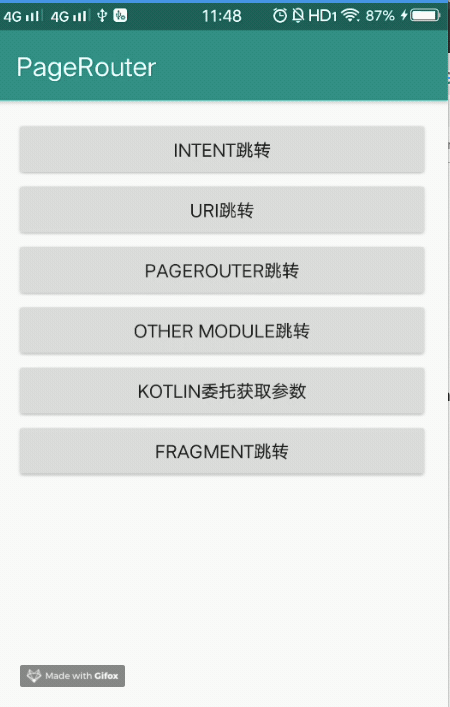

# PageRouter

```
A lightweight router framework for Android applications.
```

#### Lastest version

module|router|router-compiler|router-annotation
---|---|---|---
version|[  ](https://bintray.com/liujing/pagerouter/router/_latestVersion)|[  ](https://bintray.com/liujing/pagerouter/router-compiler/_latestVersion)|[  ](https://bintray.com/liujing/pagerouter/router-annotation/_latestVersion)

#### Demo
This repository also contains this demo project.


#### Feature

1. **Support activity jumps by standard uri**
2. **Support fragment direct jumps by assign activity container**
3. **Support multi router path**
4. **Support multi-module**
5. **Support automatic injection parameters**
6. **Support add interceptor**
7. **Support kotlin and parameters delegated**


#### Add dependencies

``` gradle

    android {
        defaultConfig {
            ...
            //multi module configuration
            javaCompileOptions {
                annotationProcessorOptions {
                    arguments = [targetModuleName: 'Other']// replace with the other module project name
                }
            }
        }
    }

    dependencies {
        // Replace the last version
        implementation "com.liujing.pagerouter:router:last-version"
        annotationProcessor "com.liujing.pagerouter:router-compiler:last-version"
        ...
    }

```

Kotlin project configuration

``` gradle
    apply plugin: 'kotlin-kapt

    // Replace the last version
    implementation "com.liujing.pagerouter:router:last-version"
    kapt "com.liujing.pagerouter:router-compiler:last-version"
```

#### Usage


**1. Initialize the SDK**

Recommended to initialize in the Application class.
``` java
    Router.init("pagerouter"); //your application's specific scheme
```

Register other module initializer or manually add router entry.

``` java
    Router.register(new OtherRouterInitializer());
    Router.register(new RouterInitializer() {
        @Override
        public void initActivityTable(Map<String, Class<? extends Activity>> router) {
            router.put("second2", SecondActivity.class);
        }

        @Override
            public void initFragmentTable(Map<String, Pair<Class<? extends Activity>, Class<? extends Fragment>>> router) {
        }
    });
```


**2. Add annotations**

Activity
``` java
    @RouterActivity({"second", "third"})
    public class SecondActivity extends AppCompatActivity {
        ...
    }
```

Fragment

``` java
    // The activityClazz here means the fragment currently associated with Activity
    @RouterFragment(value = "myfragment", activityClazz = FragmentContainerActivity.class)
    public class MyFragment extends Fragment {
        ...
    }
```


**3. Parse parameters**

```java
    @RouterActivity({"second"})
    public class SecondActivity extends AppCompatActivity {
        @RouterField("id") // map parameters in the url by name
        private int id;
        ...

        @Override
        protected void onCreate(@Nullable Bundle savedInstanceState) {
            super.onCreate(savedInstanceState);
            setContentView(R.layout.activity_common);

            Router.inject(this);// PageRouter will automatically set value of fields
            ...
        }
    }
```

**4. Start routing**

```java
    Router.startActivity(context,"scheme://second?id=17")
```


**5. Add confusing rules**

```
    -keep class * extends com.liujing.pagerouter.RouterInitializer { *; }
```


**6. Processing jump results**

```kotlin
    Router.startActivity(
       this,
       "pagerouter://other?id=17", object : RouteCallback {
            override fun onSuccess(context: Context, uri: Uri) {
                Toast.makeText(context, "success", Toast.LENGTH_SHORT).show()
       }

            override fun onFailed(context: Context?, message: String?) {
                Toast.makeText(context, "failed : $message", Toast.LENGTH_SHORT).show()
       }
    })

```


**7. From external jump**

AndroidManifest.xml

```xml
    <activity android:name=".RouterCenterActivity">
        <intent-filter>
            <action android:name="android.intent.action.VIEW"/>
            <category android:name="android.intent.category.DEFAULT"/>
            <category android:name="android.intent.category.BROWSABLE"/>

            <data
                 android:host="details"
                 android:scheme="market"/>
        </intent-filter>

        <intent-filter>
            <action android:name="android.intent.action.VIEW"/>
            <category android:name="android.intent.category.DEFAULT"/>
            <category android:name="android.intent.category.BROWSABLE"/>

            <data android:scheme="myscheme"/>
        </intent-filter>
    </activity>
```

Create a new Activity for monitoring scheme events

```java
    public class RouterCenterActivity extends Activity {
        @Override
        protected void onCreate(Bundle savedInstanceState) {
            super.onCreate(savedInstanceState);
            Uri data = getIntent().getData();
            if (data != null) {
                Router.startActivity(this, data.toString());
            }
            this.finish();
        }
    }
```

**8. Intercept jump process**

Recommended setIntercept in the Application class.

```java
     Router.setIntercept(new IIntercept() {
                @Override
                public void process(@NonNull Context context, @NonNull Uri uri, InterceptorCallback callback) {
                    if (...) {
                        //TODO do something
                        callback.onInterrupt(result, message);//interrupt routing process
                    } else {
                        callback.onContinue(uri);
                    }
                }
            });

```

**9. Global demotion strategy**

Recommended setDefaultCallBack in the Application class.

```java
     Router.setDefaultCallBack(new RouteCallback() {
                @Override
                public void onSuccess(Context context, Uri uri) {

                }

                @Override
                public void onFailed(Context context, String message) {
                    //TODO do something
                }
            });
```


#### License

    Copyright(c)  2018 Liujing

    Licensed under the Apache License, Version 2.0 (the "License");
    you may not use this file except in compliance with the License.
    You may obtain a copy of the License at

       http://www.apache.org/licenses/LICENSE-2.0

    Unless required by applicable law or agreed to in writing, software
    distributed under the License is distributed on an "AS IS" BASIS,
    WITHOUT WARRANTIES OR CONDITIONS OF ANY KIND, either express or implied.
    See the License for the specific language governing permissions and
    limitations under the License.
